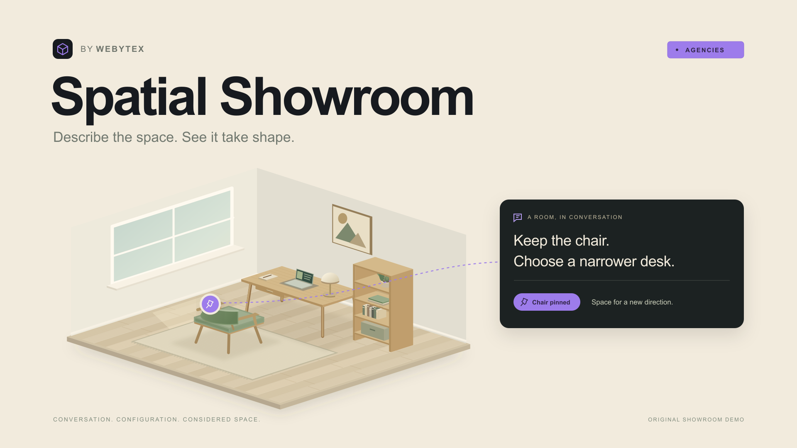

# Spatial Showroom

A conversational 3D home-office configurator by [Webytex Agencies](https://agencies.webytex.com/#contact). Explore an original fictional collection, adjust a room by hand, or ask an AI assistant for a different direction within your budget.

This is an example of a configurable ecommerce experience an agency could offer a client. The collection is illustrative and nothing is available for purchase.



## Explore the room

- Select furniture directly in the 3D scene or through the collection controls.
- Choose from ten products: three desks, three chairs, two lamps and two storage pieces.
- Change wood finish, upholstery, left or right layout, and day or evening lighting.
- Inspect the perspective or plan view, show dimensions, and reset the camera.
- Set a CAD budget, pin choices for the AI assistant, undo changes and share a configuration link.

The room is a fixed 3.6 by 3.2 metres. Original Three.js geometry renders through React Three Fiber; this is an interactive scene, not a generated room image. The catalogue defines product IDs, dimensions and prices in integer CAD cents. Prices exclude tax and shipping.

Manual editing works without an API key or live AI access. It can exceed the selected budget with a visible warning. A furniture combination that fails the room footprint checks is rejected while the previous scene stays intact.

## Run locally

Use Node.js 24 and npm.

```sh
npm ci
npm run dev
```

Open `http://127.0.0.1:3250`. Manual editing and sharing require no environment configuration. To create an optional local configuration in PowerShell:

```powershell
Copy-Item -LiteralPath .env.example -Destination .env.local
```

Keep live proposals disabled until every server prerequisite is configured and verified. Never commit `.env.local` or copy credentials into client code.

```sh
npm run typecheck
npm test
npm run build
npm start
```

The offline tests do not require paid model calls. [Validation notes](docs/VALIDATION.md) distinguish automated checks, browser evidence and outstanding checks.

## How proposals work

The browser submits a brief, current configuration, budget, pinned fields and scene revision after the visitor confirms AI processing. The server sends the canonical catalogue and combinations already checked by application code to the OpenAI Responses API. It uses `gpt-6.1-sol`, low reasoning effort and a strict structured output schema.

The model proposes a complete catalogue configuration. Application code independently validates the returned IDs, settings, budget, pinned fields and simplified geometry before a change reaches the scene. Code also calculates the displayed total and changed fields. A refusal, unavailable result or invalid proposal leaves the room unchanged.

Pins constrain AI proposals, while manual editing stays available. Pinning a chair also pins its upholstery. Manual edits, budget changes and pin changes invalidate an in-flight proposal, so a late response cannot replace newer choices. Undo restores earlier room, budget and pin state.

The geometry checks use rectangular floor footprints, a small room-boundary and inter-product gap, and desktop containment for lamps. They do not assess architectural, ergonomic, accessibility, structural or building-code suitability. This demo has no room scanning, uploads, AR, voice interaction or checkout.

## Server setup and data boundaries

The optional live route requires a server-only OpenAI key, a strong session secret, Redis credentials, an exact application origin, a configured spending allowance and explicit readiness flags. Hosted use additionally requires Vercel BotID and the deployment's rate-limit configuration. See `.env.example` for variable names. `APP_ORIGIN` must match the requesting origin exactly. `NEXT_PUBLIC_SITE_URL` is public site metadata, not a place for credentials.

Admission checks enforce the origin, a signed visitor cookie, request size, input schema and hosted browser verification before paid work. Atomic Redis operations in a dedicated spatial namespace enforce visitor, daily, concurrency and spending allowances. Each admitted attempt consumes a conservative spending reservation. Completion releases concurrency only; failed or uncertain requests do not refund the allowance and are not retried automatically. The application counter is separate from provider billing and provider-side limits.

Missing configuration, failed verification or unavailable admission storage disables live proposals while manual editing remains usable. The provider request uses `store: false`, a timeout and no automatic retries. The application does not log visitor briefs, raw provider errors, credentials or arbitrary request bodies. `store: false` is not a claim about every aspect of the provider's data retention.

Share URLs contain a versioned set of validated catalogue choices and the budget. They do not include the brief, pins, visitor cookie or credentials. Anyone with a link can read its configuration. Unsupported versions, unknown IDs, extra fields, malformed or oversized payloads, and room collisions fail safely. An over-budget manual configuration can still be shared with its warning.

## Source map

| Area | Entry point |
| --- | --- |
| Catalogue and room dimensions | `src/lib/catalog.ts` |
| Shared contracts and validation | `src/lib/contracts.ts`, `src/lib/configuration.ts` |
| Versioned sharing | `src/lib/share.ts` |
| Scene state, undo and stale-response protection | `src/hooks/use-showroom.ts` |
| Interface and 3D scene | `src/components/showroom-app.tsx`, `src/components/showroom-scene.tsx` |
| Original geometry and materials | `src/components/scene/` |
| Provider, admission and server configuration | `src/lib/server/` |
| Offline regression checks | `tests/` |

Built with Next.js, React, TypeScript, Three.js, React Three Fiber, Zod, the OpenAI SDK, Upstash Redis and Vercel BotID. The build process is documented in the [build log](docs/BUILD-LOG.md).

## Licence and agency work

The source is provided under the [MIT licence](LICENSE). All catalogue products and 3D furniture assets are original and fictional. No client code or private customer data is included.

Webytex provides founder-led nearshore engineering for Canadian agencies, including white-label delivery where the agency retains the client relationship. [Discuss a configurable experience for your client](https://agencies.webytex.com/#contact).
